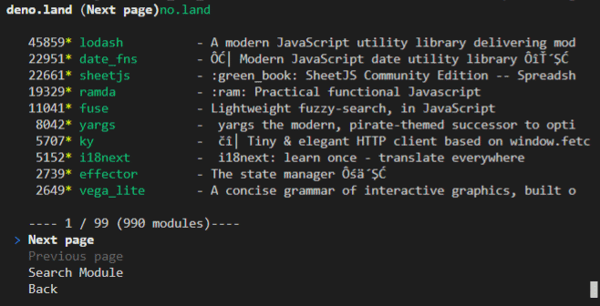
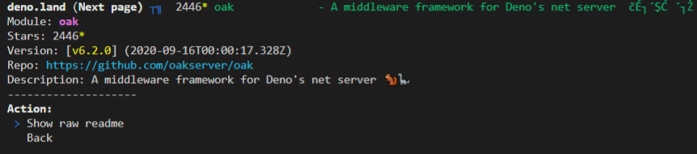
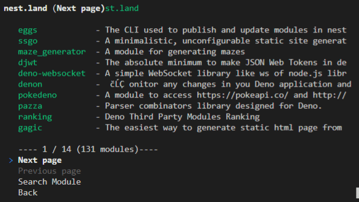

# Deno registry browser in the terminal

> It's just a hacky POC

Reads basic info from `deno.land/x` and `x.nest.land`.
Has search, module info, and can print README on deno.land registered modules

deno run --unstable --allow-net https://raw.githubusercontent.com/littletof/deno-terminal-registry-browser/master/mod.ts

## deno.land/x

## x.nest.land

### Idea

|Flag|Required|Reason|Without|
|:--|:-:|:--|:--|
| 🚧 `--unstable` | * | Needed for Cliffy to work | 🚫 Wont start |
| 🌐 `--allow-net` | * | To fetch data from the repos | 🚫 Wont start |
| 🔍 `--allow-read` |  | Needed for cache info | Wont be able to browse cached |
| 💾 `--allow-write` |  | Save favourites | Wont be able to save favourites |
| ⏱ `--allow-hrtime` |  | Allows precise benchmarking | Loss of accuracy |
| 🚩 `--allow-run` |  | Needed for feature x | Feature wont be available |
| 🔮 `--allow-all` |  | It should never be required | You have to type out flags |
| 🧭 `--allow-env` |  | Needed to access your ENV |  |
| 🧩 `--allow-plugin` |  | Needed to run RUST plugins | no automatation |

